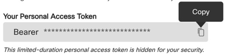

# Postman Visualizing with Webex

*Postman Visualizing with Webex for DevNet Create 2021*

---

## Motivation

This project is intended to show off some of the Webex analytics apis and turn their response into something illustrative. 

## Technologies & Frameworks Used

REST APIs, Cisco Webex, Postman

## Usage / Lab

### Step 1 Select an Webex Org to Analyze 

To get the most of out of this project you are going to want to have a Webex site for which:  
1. You have an account with either read-only-admin or full-admin roles for the given org. Some endpoints may require  the access token must have the analytics:read_all scope the org may need to be licensed for pro pack (example: meeting/qualities).
2. Preferably, the org has some historical data in it (though you can always add some) to retrive.

If you do not have an site that meets these requirements you could:
* Use [Cisco's demo toolbox to spin up an analytics org](https://demotoolbox.cat-dcloud.com/demo/demo-webex-analytics). This is the best method, as there is a lot of fake data already in the org, however access is limited to Cisco Employees and Partners. If you haven't used it before, there are step-by-step guides on the toolbox page to get you started.
* Use [Devnet's sandbox](https://developer.cisco.com/site/sandbox/) (though you may have to create some data to look at). DevNet provides both a Webex sandbox and a collaboration endpoint (Room Kit) sandbox. 
* Start a Webex trial. _Note its best to ask your account team for a trial, since some online trials may not give you administrative access._

I spend much of my time focused on Cisco's partner community, so I am going to use demo toolbox for the remainder of the instructions, but the ideas should apply to any setup.

### Step 2 Get your Access Token
Cisco Webex APIs use bearer tokens for authentication. A quick method to turn a username & password into a token is to login to the [Webex Developer Getting Started Page](https://developer.webex.com/docs/api/getting-started) and click on the copy button (save the token for later). _Note: while this is good for a demo/test, oauth should be used in place of personal tokens for any production application._



### Step 3 Start with JSON

Before we add visualization, we should start with a basic JSON response from an Webex endpoint via [Postman](https://www.postman.com) ([install postman](https://www.postman.com/downloads/) if you have not already). For the past several years, the video endpoints Cisco has produced include a wide variety of sensors and artificial intelligence that can measure People Count, Temperature, humidity and more. The analytics demotoolbox org has devices in it that are reporting back lots of that data that we can use for our first visualization. _Note: I am going to choose an endpoint that makes a good demo, but concepts below could apply to any analytic endpoint._  The endpoint we need is "workspaceMetrics", but it requires us knowing a valid workspace (think of this as the location where the video device is installed). In postman (or via the "try it feature" on the [developer portal](https://developer.webex.com/docs/api/v1/workspaces/list-workspaces)) we can send a GET request to https://webexapis.com/v1/workspaces and the response will show us a list of workspaces. In postman we will need to include the header "authorization Bearer" followed by the token previously saved (if you use the developer portal, the bearer will be entered for you if you have logged in). In the analytics demo, I know that the "CxO Desk Pro" has some data associated to it, so I am going to save its "id".


Now I am ready to get my JSON response. In postman I am going to do a new GET, this time to https://webexapis.com/v1/workspaceMetrics endpoint. I will use the same bearer token, but for metrics we will need to provide ouple extra parameters:

* workspaceId: set to the value previously saved.
* metricName: I am going to choose humidity, but possible values include soundLevel, ambientNoise, temperature, humidity, tvoc, and peopleCount
* aggregation: I am going to choose daily, but possible values include none, hourly, & daily
* from: I am going to enter Aug 1 as the starting date & time. In ISO 8601 that will be 2021-08-01T00:00:00.000Z
* to: I will enter Aug 30 as the ending date & time. In ISO 8601 that will be 2021-08-30T00:00:00.000Z
* SortBy: Tables & graphs look super wierd if you go in reverse date order so I highly recomend setting this to 'oldestFirst'

The response I get is a list of the humidity in the room over the 30 days. Although Postman by default tries to pretty up the JSON, it's still not as readable as it could be.


### Step 4 PM Visualizing with Tables

Looking back at the response we previously got, we are going to try and track the max humidity over the month. Using standard JSON nomenclature the "items" is array objects I got as part of the response. I want value that goes with the "max" key across the array.  Postman allows for Test scripts (written in JavaScript) that can be applied to any request. The pm.visualizer method can be called as part of a test to render HTML output. 

Here's the starting Javascript that shows the basics. The top half of the code is a [handlebar template](https://handlebarsjs.com/) designed to loop over each response and provide the max value. The bottom half invokes the visualizer method passing it the template and the response data.
```
var template = `
{{#each response.items}}
{{max}}
{{/each}}
`;

// Set visualizer
pm.visualizer.set(template, {
    // Pass the response body parsed as JSON as `data`
    response: pm.response.json()
});
```

Plugging this into the "tests" area of postman and re-sending our GET request now provides a new response type, "Visualize." 


Pretty simple right?Now we'll go a bit further and add some HTML table structure and the rest of the values. So the new template looks like this:
```
<table>
<TR>
<TH>date</TH>
{{#each response.items}}
<TD>{{start}}</TD>
{{/each}}
</TR>
<TR>
<TH>min</TH>
{{#each response.items}}
<TD>{{min}}</TD>
{{/each}}
</TR>
<TR>
<TH>max</TH>
{{#each response.items}}
<TD>{{max}}</TD>
{{/each}}
</TR>
<TR>
<TH>mean</TH>
{{#each response.items}}
<TD>{{mean}}</TD>
{{/each}}
</TR>
</table>
```
And our new output looks like this: 


While it's easier to read than the original JSON response, we can do better. 

### Step 4 Graphs

Postman has a [guide on their site that includes a readymade test Bar Chart using ChartJs](https://documenter.postman.com/view/4946945/SVzz4KxB?version=latest). One of the golden rules of coding is if the code exists, the don't re-write it. So we are going to follow their example and just replace their data with ours.  On their site I can "Run in Postman" and import their sample code. 


I won't copy their full code here, instead just the few lines that need to be changed. If you wish to follow along I suggest you import their sample and review the comments about how it works. Their code uses ChartJs's bar chart (which works), so I just need to alter the labels and the data. 

First we have the array of strings that makes up the labels. 

```
labels: res.data.labels.map((x,index) => index + 1 ),
```

In our example this is going to be the dates in 'response.items.start.' We need to get just those dates into a new array so we'll use the map method. While we are at it, I suggest we cut down the date string to it easier to read (using the substr method).  Now we have:

```
labels: res.items.map(({start}) => start.substr(5,5)),
```
In a similar fashion we need to get the max values into the data array. 
```
data: res.items.map(({max}) => max)
```

The rest is just cosmetic. We will simply replace the title "Count" with "Maximum Daily Humidity", the x axis label string of "Time Slot" with "Date" and the y axis label "Count" with "Humidity (%)".


There we have it! Simple visualization of our data. There's so much more we can do.  I challenge you to dig a little deeper into ChartJs and see how it can impact your API calls. 

## Authors & Maintainers

For now its just me, but if you want to add some more ideas, I welcome it!

- Steve Greenberg <stgreenb@cisco.com>

## Credits

A lot of this code mimics code that you can find on Postman's site. 

## License

This project is licensed to you under the terms of the [Cisco Sample
Code License](./LICENSE).
